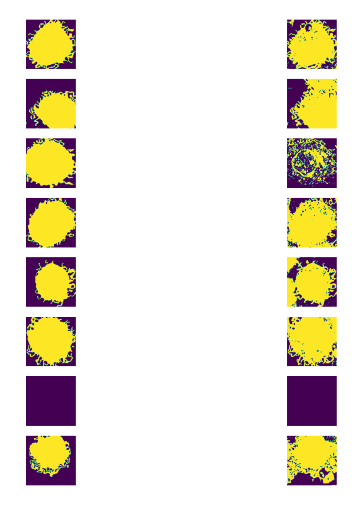

# Image segmentation

## 1 U-Net: Image Segmentation using deep learning

Implement the U-net architecture for cell image data segmentation using PyTorch.

Figure 1: U-Net architecture[1]

#### The Convolutional Blocks Definition:
1. a 3 × 3 un-padded convolution layer which takes a feature map with `input_channel` number
    of channels and outputs a feature map withoutput_channelnumber of channels
2. a ReLU activation function
3. another 3 × 3 un-padded convolution layer which keeps the number of channels unchanged
4. a Batch normalization layer
5. a ReLU activation function

#### Data augmentation:
Since the size of the data is too small for training a neural network with a huge number of
parameters. Under this situation, the code has the following data augmentation applied:
1. Horizontal/Vertical flip
2. Zooming
3. Rotation

#### Final Results:

**Left is label, right is the corresponding prediction.**

#### References

[1]Olaf Ronneberger, Philipp Fischer, and Thomas Brox. U-net: Convolutional networks for
biomedical image segmentation. InInternational Conference on Medical image computing and
computer-assisted intervention, pages 234–241. Springer, 2015.

